# Freight Rate Prediction — Technical Report

**Author:** daniel@ayautomate.com
**Code:** [`freight_rate_prediction.ipynb`](../freight_rate_prediction.ipynb) — complete solution, one notebook, runs top to bottom
**Deliverables:** `validation_predictions.csv` · `outputs/december-chart-inputs.csv` · `scorer_results/candidate_december.png`

---

## Contents

| § | Section |
|---|---|
| 1 | Executive summary |
| 2 | Understanding the problem |
| 3 | Data inventory and temporal structure |
| 4 | The target variable |
| 5 | Data-quality audit |
| 6 | What drives price |
| 7 | The cold-start problem |
| 8 | The December extrapolation trap |
| 9 | Feature validation by ablation |
| 10 | Model selection and validation |
| 11 | Deliverables and verification |
| 12 | Limitations and next steps |

---

# 1 · Executive summary

I was asked to predict `posted_rate` — the price posted for a truckload freight shipment — for
12,000 loads in November and December 2025, given 48,000 labeled loads from January to October.

## 1.1 Final result

| | |
|---|---|
| **Model** | LightGBM, L1 objective, 4 cyclical seasonal harmonics |
| **Target** | `log(posted_rate / distance)`, reconstructed as `exp(pred) × distance` |
| **Validation** | 4-fold rolling-origin (walk-forward); random K-fold rejected as invalid |
| **Out-of-time MAE** | **$98.38** vs **$192.12** for a domain baseline — **49% better** |
| **Out-of-time MAPE** | **4.30%** |
| **RMSE / R²** | 624.7 / 0.828 |
| **Worst fold** | $109.57 — beats the baseline on *every* individual fold |
| **On clean rows only** | ~$45; the remainder is irreducible label corruption |

## 1.2 The three findings that shaped the solution

**1. December falls outside the training calendar entirely, and the obvious approach fails
silently.** Training covers day-of-year 1–304; December is 335–365. Because gradient-boosted
trees are piecewise-constant and cannot extrapolate, naive date features produce a December
forecast with **7 distinct values across 31 days** — seasonality silently replaced by a
day-of-week cycle. Critically, *no accuracy metric detects this*, because every cross-validation
fold sits inside the observed date range. Cyclical encoding fixes it (§8).

**2. Feature importance and variance share both misled me, in opposite directions.**
`quote_signal` ranked **#1 of 25** by LightGBM gain and is noise — adding it costs ~$18 of MAE.
Day-of-week ranked **last** by univariate variance share and is worth $6.48. Only out-of-time
ablation got both right (§9).

**3. The injected label corruption is load-bearing.** 672 corrupted rows make an untrimmed
squared-error objective collapse to 200+ MAE, and render RMSE useless as a selection criterion —
it sits at ~625 for every reasonable configuration (§5, §10).

A fourth point is methodological: **three separate mistakes in this project came from trusting a
number that answered a slightly different question than the one I was asking.** All three are
documented rather than edited out.

---

# 2 · Understanding the problem

## 2.1 The business context

`posted_rate` is the dollar amount posted to move one truckload from an origin city to a
destination. In a brokerage this is the number a pricing team must get right: quote high and the
shipper goes elsewhere, quote low and the load moves at a loss. The available inputs — origin,
destination, distance, equipment, weight, date — are the ones a broker genuinely has at quoting
time, so the features here are the features that would exist in production.

## 2.2 What the scorer revealed

I read `score.py` before writing any modelling code, and it turned out to be the most
informative file in the repository.

**`score.py` computes no accuracy metric.** It validates format, draws a chart, and prints
*"Final validation metrics are calculated by Spotter after submission."*

This is a real constraint. I do not know whether I am graded on MAE, RMSE, MAPE or R², so I
cannot tune to one number. I selected on balanced performance across all four and report all
four. This matters concretely: §10.5 shows that RMSE and MAE actively disagree about what is good
on this dataset.

**The hard format rules**, extracted so I could assert against them programmatically rather than
discover a violation at submission:

| Constraint | Source in `score.py` |
|---|---|
| Columns exactly `load_id,predicted_rate`, in order | `validate_predictions` |
| Exactly 12,000 rows, IDs `TE-000001`…`TE-012000` | `EXPECTED_ROWS`, `EXPECTED_IDS` |
| No NaN or infinite values | `numeric_series` |
| **Every prediction strictly positive** | `if (predicted_rate <= 0).any(): fail(...)` |
| December keeps its original 7 columns **in original order**, inputs untouched | `validate_december` |

The strict-positivity rule later influenced my choice of target: one candidate formulation
satisfies it by construction, the other requires clipping.

## 2.3 The December file is a test in disguise

This observation changed how I approached the entire problem.

`december-chart-inputs.csv` holds **every input constant except the date** across its 31 rows —
same origin, same destination, same 360 miles, same Dry Van, same 32,000 lb. `score.py` enforces
each of those with an assertion and captions the chart *"only date changes."*

If every input except date is fixed, then **every dollar of variation in that chart comes from
the model's handling of time, and nothing else.** It is a controlled experiment on the seasonal
component, presented as a deliverable. §8 shows this is not a hypothetical concern.

## 2.4 A structural hint in the column counts

`validation.csv` has 13 columns; `december-chart-inputs.csv` has 7. The December file lacks
coordinates, `market_index`, and `quote_signal`.

Since both deliverables should come from the same model, this constrains which features are
legitimately in scope. Anything I cannot compute for those 31 rows forces either a second model
or invented values. I adopted the constraint deliberately, and §9 shows the excluded columns were
not worth having anyway.

---

# 3 · Data inventory and temporal structure

| File | Rows | Period | Target |
|---|---|---|---|
| `train-test.csv` | 48,000 | Jan 1 – Oct 31 2025 | yes |
| `validation.csv` | 12,000 | Nov 1 – Dec 31 2025 | no |
| `december-chart-inputs.csv` | 31 | Dec 1–31 2025 | no |

Structural profile: 64 cities, 3 equipment types, 4,014 lanes, **no duplicate rows or IDs**.
Nulls in `weight` (300, 0.63%) and `market_index` (374, 0.78%). `quote_signal` has **37,633
distinct values across 48,000 rows** — a cardinality worth remembering for §9.

## 3.1 The windows are strictly sequential

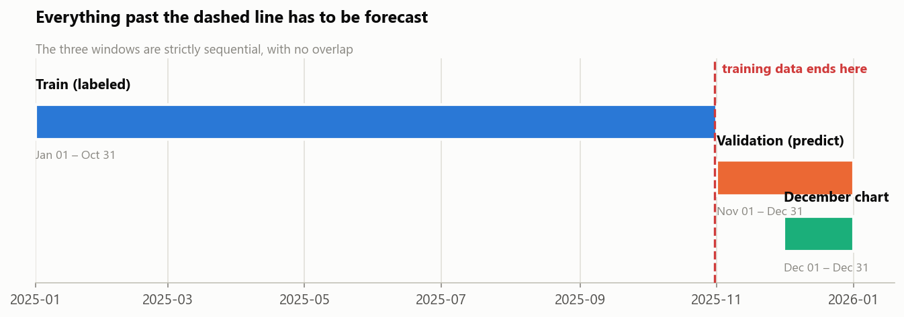

Training ends 31 October; validation begins 1 November. **They do not overlap.** Three
consequences constrain everything downstream:

1. **Random cross-validation is invalid** — it would fit on the future to predict the past (§10.1
   gives a second, more serious reason).
2. **I must forecast up to two months beyond my data** — meaningfully harder than one step ahead.
3. **December lies outside the observed calendar entirely** — the subject of §8.

## 3.2 Distribution shift check

Before building anything I checked whether validation resembles training. If distributions had
shifted, learned patterns would not transfer.

| Column | Train median | Validation median | Ratio |
|---|---|---|---|
| distance | 953.3 | 953.6 | 1.000 |
| weight | 31,496 | 31,332 | 0.995 |
| quote_signal | 2.1 | 2.1 | 0.998 |
| **market_index** | **1.1** | **0.9** | **0.874** |

Equipment mix matches within 0.3 percentage points. **No covariate shift to correct for** — with
one exception. `market_index` sits 13% lower in validation, a genuine shift in a feature. That is
the first mark against that column; §9 adds two more and drops it.

---

# 4 · The target variable

## 4.1 Why dollars per mile

Freight is priced per mile, not per load. The same $3,000 is cheap for 2,000 miles and
extortionate for 200. A raw `posted_rate` confounds *how expensive this lane is* with *how long
the trip is*, so I derive `rate_per_mile = posted_rate / distance` and use it as the analytical
lens throughout.

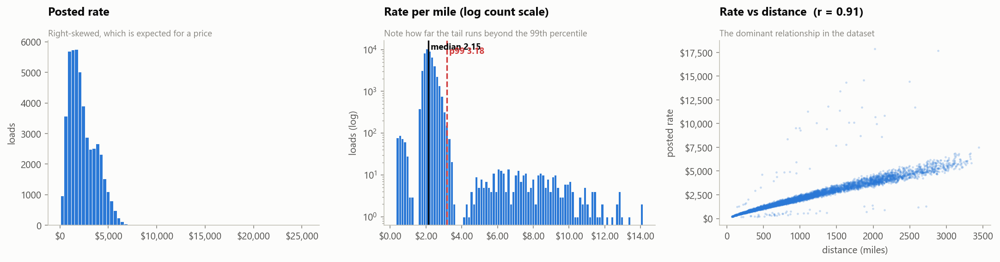

## 4.2 Reading the distributions

**`posted_rate` is right-skewed** — normal for a price with a floor at zero and no ceiling.

**Rate tracks distance almost linearly, r ≈ 0.91.** This is the backbone of the problem and
explains why the naive baselines in §10.3 perform as well as they do.

**The middle panel changed my plan.** Rate-per-mile clusters tightly around 2.15 — a realistic
market rate — but the tail extends to **14.1 $/mile**, over four times the p99 of 3.18.

That is not a plausible price distribution. Freight markets are volatile, but a load at 14
dollars a mile against a market median of 2.15 is not a market event; it is a broken record. My
working hypothesis was **corrupted labels rather than expensive loads**, and §5 confirms it.

## 4.3 Two modelling decisions that follow

**Use a robust loss.** Squared error penalises an error of $2e$ four times as heavily as $e$.
With hundreds of rows whose labels are 5–7× too large, a squared-error objective spends its
capacity fitting rows that are simply wrong. L1 grows linearly, so a bad label pulls
proportionally rather than quadratically. §10.5 tests both — the gap is enormous.

**Consider `log($/mile)` as the target**, reconstructed as `exp(pred) × distance`. Three
arguments:

1. **It removes the dominant factor before modelling starts**, letting the model spend capacity
   on residual structure — region, equipment, season — rather than re-learning that long trips
   cost more.
2. **It converts multiplicative error into additive error.** Being $100 out on a $500 load is
   serious; $100 out on a $5,000 load is close. Logs make the loss reflect that.
3. **It guarantees positive predictions.** `exp()` is positive for any real input, satisfying the
   scorer's rule *structurally* rather than by clipping — and a clipped prediction is a silent
   admission the model produced something impossible.

§6.4 adds a fourth argument; §10.5 tests the formulation head-to-head.

---

# 5 · Data-quality audit

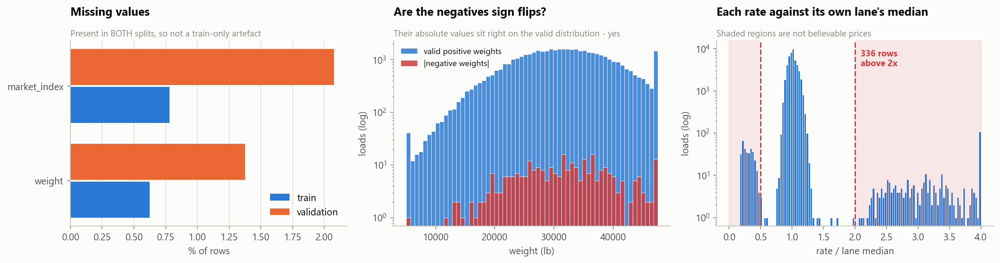

| Defect | Rows | Evidence | Action |
|---|---|---|---|
| **Sign-flipped weights** | 292 | \|negatives\| distribution matches positives (mean 31,724 vs 31,415), ranges identical | `abs()` — repair, don't drop |
| **Weights at 47,500 cap** | 1,191 | exact repeated value at range maximum | keep + `weight_at_cap` flag |
| **Missing weight** | 300 | also present in validation | median impute + `weight_missing` flag |
| **Missing `market_index`** | 374 | also present in validation | column dropped entirely (§9) |
| **Implausible rates** | 672 | outside 0.5×–2× of their own lane's median | **flag only, never delete** |

## 5.1 Diagnosing the negative weights

292 negative weights could be random garbage or sign flips of valid measurements — a testable
distinction. If random, their magnitudes would look nothing like real weights; if sign flips,
indistinguishable.

The means differ by under 2% and the ranges are identical. The middle panel plots the absolute
values of the negatives on top of the positives: they overlay exactly across the whole range.
**These are sign flips**, so `abs()` recovers 292 rows of genuine information that dropping would
discard.

## 5.2 Detecting corrupted rates

Rather than a global threshold — which would wrongly flag genuinely expensive short hauls — I
compare each load against **the median of its own lane**. A load at 4× what that specific route
normally costs is implausible in a way a globally high rate is not. This flags 672 rows (1.4%).

## 5.3 The central decision: flag, don't delete

This was the judgement call I spent longest on.

Deleting the 672 corrupted rows would immediately improve my cross-validation score. **But the
holdout contains them too, and so will whatever set Spotter grades.** Deleting them from
validation folds means:

- my reported CV error drops,
- my actual accuracy does not change at all,
- and I have quietly stopped measuring the part I am worst at.

That is a validation scheme that looks good right up until submission. So instead:

| Approach | Rationale |
|---|---|
| Keep them in the holdout, always | keeps the error estimate honest |
| Use L1 loss | limits how much leverage a wrong label has on the fit |
| Test training-set-only trimming as a variant | trimming the *fit* while leaving the *holdout* intact is legitimate — §10.5 shows it adds nothing under L1 |
| Report clean-row and all-row error separately | separates model error from irreducible label noise |

**Result: $98.50 MAE on all rows, $44.63 on clean rows.** That gap is the corruption, and it is a
floor no amount of modelling can get below. It also explains why **RMSE is unusable for selection
here** — it sits at ~625 for every decent configuration because it is dominated by those labels
rather than by anything I control.

---

# 6 · What drives price

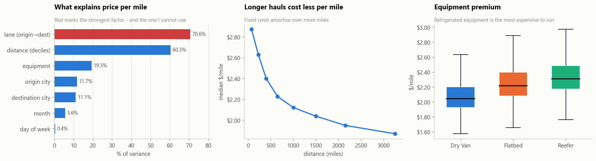

## 6.1 Variance decomposition

For each factor: how much of the spread in `log(rate per mile)` does it explain alone?

$$\text{variance explained} = 1 - \frac{\operatorname{Var}(y - \bar{y}_{\text{group}})}{\operatorname{Var}(y)}$$

Computed in logs (pricing effects are multiplicative) and on clean rows only (the 672 corrupted
labels inflate the denominator and dilute every factor uniformly).

| Factor | % of Var(log $/mile) explained |
|---|---|
| lane (origin→destination) | 70.6% |
| distance (deciles) | 60.3% |
| equipment | 19.3% |
| origin city | 11.7% |
| destination city | 11.1% |
| month | 5.6% |
| day of week | 0.4% |

## 6.2 The economics check out

**Distance dominates at 60.3%**, with `$/mile` falling from **2.87 under 150 miles to 1.87 over
2,500**. This is real freight economics: much of the cost of a haul is fixed regardless of length
— loading, unloading, paperwork, deadhead to pickup. Over 150 miles those fixed costs dominate;
over 2,500 they barely register.

**Equipment explains 19.3%**, ordered **Reefer (2.38) > Flatbed (2.29) > Dry Van (2.12)**. Also
correct: a reefer costs more to buy and burns fuel running the refrigeration unit; a flatbed needs
securement and tarping skills; a dry van is the commodity option.

**These two sanity checks matter beyond the features themselves.** They confirm the dataset
behaves like genuine freight, which materially raises confidence that the strong signals are real
structure rather than a leak.

## 6.3 Lane is a trap

Lane explains 70.6% — the strongest factor, and unusable, for two independent reasons:

1. **It is mostly memorisation.** 4,014 lanes across 48,000 rows is ~12 observations each. A lane
   effect estimated from 12 noisy observations largely fits those specific loads.
2. **736 validation lanes never appear in training** (§7).

## 6.4 Two things the variance chart gets wrong

The decomposition is **univariate** — it measures each factor in isolation. That makes it reliable
for spotting traps and unreliable for dismissing features. It misled me twice.

**Weight looks irrelevant and is not.** Unconditionally it correlates just **+0.07** with
`$/mile`. Within an equipment type it is **+0.20**, with `$/mile` climbing monotonically across
weight quintiles (2.069 → 2.211). The cause is confounding: heavy loads skew toward long hauls,
and long hauls are *cheaper* per mile, so the two effects partially cancel.

**Day of week looks irrelevant and is not.** It measures 0.4% here; removing it costs **$6.48 of
MAE** (§9.3).

**No season × distance interaction.** I checked whether seasonality hits short and long hauls
differently — the long/short ratio stays between 0.861 and 0.874 all year. Season acts as a
**uniform multiplicative factor**, which is a fourth argument for the `log($/mile)` target: a
multiplicative effect becomes a simple additive offset in log space, which is far easier to learn
and to extrapolate cleanly.

---

# 7 · The cold-start problem

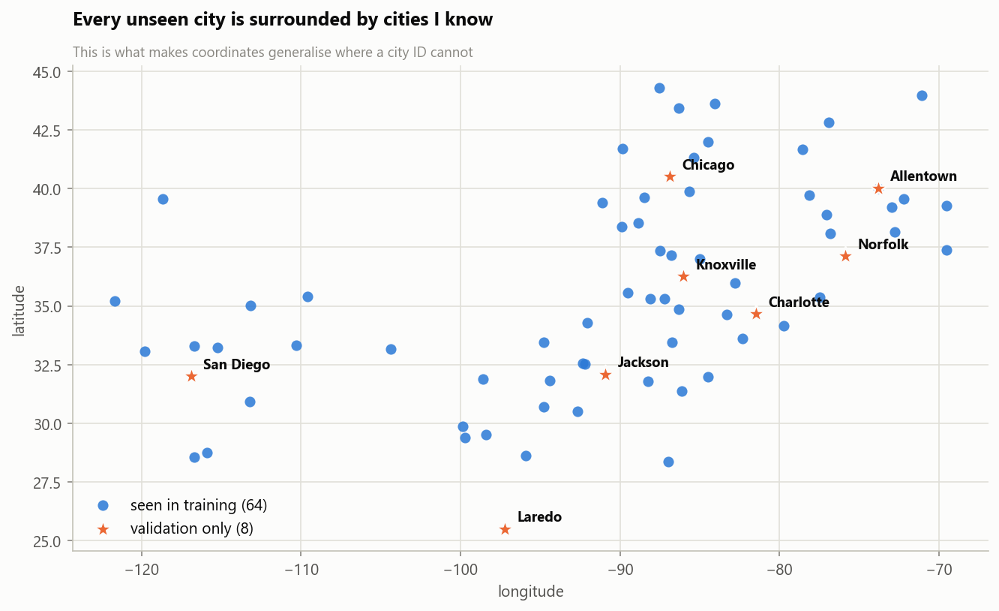

**Eight cities appear only in validation** — Allentown, Charlotte, Chicago, Jackson, Knoxville,
Laredo, Norfolk, San Diego — affecting ~12% of validation rows, plus **736 unseen lanes**. This is
the assessment testing cold-start handling.

## 7.1 Why this rules out categorical encoding

A one-hot `city_Charlotte` column would be **zero in all 48,000 training rows**. The model has no
opportunity to learn any split or coefficient on it. At prediction time it flips to 1 for the
first time and contributes nothing. The same argument applies with more force to lane.

## 7.2 Why coordinates work instead

Every city carries lat/lon, and validation supplies them. Coordinates are **continuous**, so an
unseen city is not a new category but a new *position* — and positions interpolate.

This only works if unseen cities lie *within* the learned region, so I checked. Every one of the
eight sits comfortably inside the convex hull of the training cities: Charlotte between Greensboro
and Columbia, Chicago between Milwaukee and Fort Wayne, San Diego near Los Angeles. **This is
interpolation, not extrapolation** — precisely where trees are reliable.

**Decision: encode geography as lat/lon plus trip span (Δlat, Δlon); never city or lane IDs.**
Verified in §11.2.

## 7.3 A feature I kept for the wrong reason

I added Δlat/Δlon expecting to capture **headhaul versus backhaul** asymmetry — the real
phenomenon where regions importing more freight than they export price the inbound leg higher,
because trucks return empty.

I tested whether it exists here: forward and reverse lanes correlate **0.92** with a median
asymmetry ratio of exactly **1.000**. **The asymmetry does not exist in this dataset**, so my
stated justification was wrong.

I kept the features anyway — ablating them raises MAE from 98.4 to 101.2. They encode *how far and
in which direction the trip spans*, a compact summary of trip geometry. Right feature, wrong
reason, and I have recorded it that way rather than retrofitting the explanation.

---

# 8 · The December extrapolation trap

**This is the most important section.** It concerns a failure invisible to every accuracy metric
I compute.

## 8.1 The seasonal signal

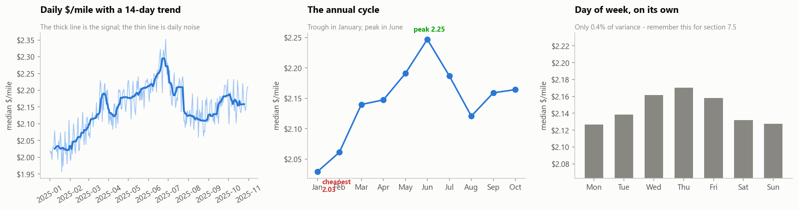

A clear annual cycle with ~11% peak-to-trough spread: cheapest in January (2.029 $/mile), rising
to a June peak (2.248), easing through autumn. Day of week, by contrast, looks like nothing —
remember that.

## 8.2 The problem

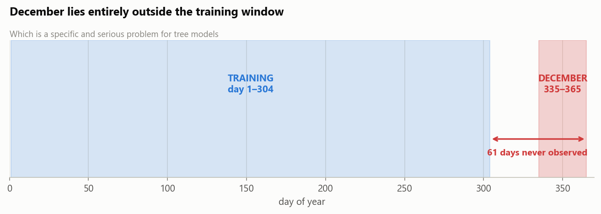

Training spans **day-of-year 1–304**. December is **335–365**. I am being asked about a region of
the calendar that appears nowhere in my training data.

## 8.3 Why this breaks trees specifically

A gradient-boosted tree is a **piecewise-constant function**. It partitions the feature space with
axis-aligned splits and predicts a constant in each region.

Training stops at day 304, so **no split can exist above that value**. Everything above the
highest split point is one unbounded region with one constant attached. Ask about day 350 and the
model returns whatever it learned for late October — and the *same* value for 340, 350 and 365. A
piecewise-constant function has no slope to extend.

This is not a bug. It is the defining property of the model class: linear models extrapolate
(sometimes disastrously), trees flatten. For most problems flattening is safer. Here it is fatal.

## 8.4 The fix: cyclical encoding

The calendar is a **circle, not a line**. 31 December is one day from 1 January, not 364. So
project the date onto a circle:

$$\sin\left(\frac{2\pi k \cdot \text{doy}}{365.25}\right), \qquad \cos\left(\frac{2\pi k \cdot \text{doy}}{365.25}\right)$$

Both are required — sine alone is ambiguous, taking the same value twice per cycle; the pair
identifies position uniquely.

Under this encoding **December's feature values are numerically close to January's**, and January
has 4,918 observations. The model interpolates toward a region it knows well instead of
extrapolating into nothing. An impossible problem becomes an ordinary one.

## 8.5 The empirical proof

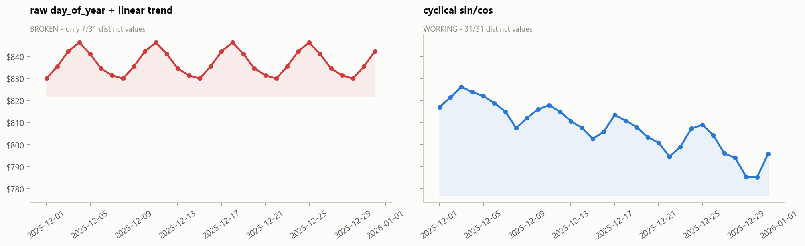

The same model trained twice, identical except the date encoding:

| Encoding | Distinct values / 31 | Behaviour |
|---|---|---|
| raw `day_of_year` + linear trend | **7** | weekly sawtooth; **no seasonal content at all** |
| cyclical `sin/cos` | **31** | smooth seasonal decline |

The left panel repeats its first three values at month-end. Every `doy` above 304 landed in the
same leaf, so the seasonal features contribute a constant across all of December. **The only
feature still varying is day-of-week — which §6.1 measured at 0.4% of variance.**

**What makes this dangerous is that it does not look broken.** It is a plausible wiggly line with
sensible values. And **no metric I compute would catch it**, because every CV fold sits inside the
observed range where the failure cannot manifest.

## 8.6 Choosing the harmonic order — where I was wrong

I originally capped the expansion at **k=2**, reasoning that higher harmonics oscillate more and I
had a 61-day unconstrained gap to cross. Prudent-sounding, but flawed: **my CV could not test that
concern.** Every fold is in-range, so CV measures in-range fit; my worry was about out-of-range
behaviour. Different questions.

So I measured out-of-range behaviour directly — fitting each order and generating the full
October→December curve:

| k | CV MAE | Worst fold | December curve |
|---|---|---|---|
| 1 | 116.80 | 152.24 | monotone, nearly flat |
| 2 | 104.30 | 133.44 | monotone |
| **4** | **100.00** | **115.85** | **monotone, sensible Oct→Dec step** |
| 6 | 100.69 | 111.81 | monotone |

k=4 improves mean MAE *and* worst fold, and the oscillation I feared never appears — the model is
fitting a genuine annual shape rather than chasing noise. **My caution had cost ~$6 of MAE.**

The lesson: I was *reasoning* about a risk instead of *measuring* it, using a validation scheme
that could not see the thing I was worried about.

---

# 9 · Feature validation by ablation

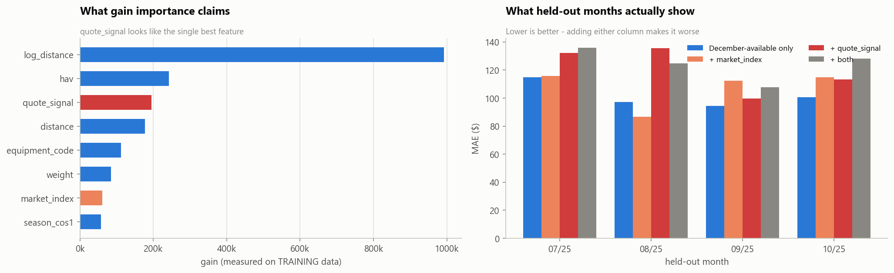

## 9.1 What importance claims

`quote_signal` ranks **#1 of 25 by LightGBM gain**, ahead of distance — and correlates **0.05**
with the target. Those facts cannot both mean what they appear to, and the mismatch is the
diagnostic.

**What gain actually measures:** for each split, how much the loss fell **on the training data**.
It answers *what did this feature help the model fit?*, not *what will generalise?*

**The mechanism:** `quote_signal` takes 37,633 distinct values across 48,000 rows — nearly unique
per row. At that granularity a tree can almost always find a threshold isolating a few training
rows that happen to share an unusual target. Across 900 trees those reductions accumulate into an
enormous gain total. But the split encodes nothing transferable: it memorised *which rows* were
unusual, not *why*. High-cardinality continuous noise is the textbook failure case for
impurity-based importance.

## 9.2 What held-out data shows

| Feature set | mean MAE across 4 folds |
|---|---|
| **December-available only** | **$101.76** |
| + `market_index` | $103.40 |
| + `quote_signal` | **$120.14** |

Adding `quote_signal` makes held-out error **substantially worse** (+$18.38). `market_index` also
fails, which combined with its 13% distribution shift (§3.2) makes it an easy exclusion.

**Both dropped.** This costs nothing in accuracy and lets a single model serve both deliverables.
Had I trusted the importance chart, I would have built a two-model architecture to preserve a
noise column.

## 9.3 The same test in reverse

Removing `dow` — which variance share ranked last — **costs $6.48 of MAE**. It explains almost
nothing alone but carries real information conditional on distance, equipment and season.

## 9.4 The methodological point

| Heuristic | Feature | Its verdict | The truth |
|---|---|---|---|
| Gain importance (training-set) | `quote_signal` | **#1 of 25** | noise; costs ~$18 MAE |
| Variance share (univariate) | `dow` | **last, 0.4%** | useful; worth $6.48 MAE |

Neither is reliable, because each answers a different question:

- **Gain**: *what did the model lean on while fitting training data?* → rewards memorisation
- **Variance share**: *what does this explain alone?* → ignores conditional contribution
- **Ablation**: *does keeping this improve predictions on unseen data?* → the actual criterion

**Importance scores and univariate summaries generate hypotheses. Only held-out ablation decides
what ships.**

---

# 10 · Model selection and validation

## 10.1 Why random cross-validation is disqualified

**The obvious reason:** shuffling places November rows in training and September rows in test —
fitting on the future to predict the past.

**The serious reason:** it is blind to the failure I most need to catch. The broken model from
§8.5 — whose December forecast is a pure day-of-week artefact — would score *excellently* under
random K-fold. Its failure only appears when asked about dates outside its training range, and
random folds never do that. **The single most dangerous defect available in this problem is one
random CV is structurally incapable of detecting.**

## 10.2 Rolling-origin validation

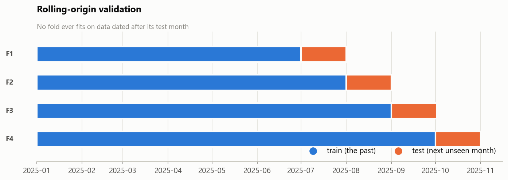

| Fold | Training window | Test month | MAE |
|---|---|---|---|
| 1 | Jan – Jun | July | $109.57 |
| 2 | Jan – Jul | August | $91.25 |
| 3 | Jan – Aug | September | $93.87 |
| 4 | Jan – Sep | October | $98.84 |
| | | **mean** | **$98.38** |

Each fold trains only on data dated strictly before its test month, and the window grows as the
origin rolls forward — mirroring how a deployed model would be periodically retrained.

**Every decision is averaged across all four folds.** Per-fold MAE spans $91–$110, enough that a
single split can reverse a comparison. Early on I nearly kept `quote_signal` on one favourable
month.

**Limitation:** the largest gap this scheme can simulate is **one month**, but the real task
forecasts **two** (into December). I am therefore mildly optimistic about true December error and
cannot measure by how much. The cyclical encoding is what protects the longer horizon.

**Final fit:** retrained on all 48,000 rows. Fold models existed only to select the configuration;
the shipped model should see every row, and for a forecast the most recent months matter most.

## 10.3 Baselines

| Baseline | MAE | MAPE |
|---|---|---|
| always predict the mean | 1,179.80 | 86.4% |
| global median $/mile × distance | 253.85 | 11.8% |
| equipment median $/mile × distance | 231.30 | 10.9% |
| **lane median $/mile × distance** | **192.12** | **8.2%** |

The lane-median rule is the honest bar — close to what an experienced broker does from memory,
using no ML at all. The progression is itself informative: predicting the mean is hopeless because
it ignores distance, while simply multiplying a global $/mile by distance cuts error by 80%,
confirming that distance is most of the problem.

## 10.4 Why LightGBM

| Property of the data | Implication |
|---|---|
| ~48k rows, ~23 tabular features | Boosted trees are state of the art in this regime |
| Strongly non-linear ($/mile decay) | Rules out linear models without manual curve construction |
| Interactions matter | Trees capture these automatically |
| Missing values present | Handled natively |
| Corrupted labels retained | Needs a robust objective — L1 available |
| ~60 fits needed for selection | Minutes, not hours |

**Rejected:** *ridge* (cannot represent the hyperbolic decay unaided — kept as an interpretable
reference); *random forest* (averaging deep trees smooths the sharp decay that carries the
signal); *neural network* (wrong tool at 48k tabular rows — more tuning, typically worse, and
costs the interpretability that made §9 possible).

Trees' one real weakness — no extrapolation — is the §8 trap, already defused by cyclical
encoding. That is what makes LightGBM *safe* here, not merely convenient.

## 10.5 Target and loss

| Choice | Result |
|---|---|
| **L1** vs L2 (untrimmed) | ~98 vs **200+** MAE |
| **L1** vs L2 (trimmed fit) | near-identical — L1 needs no rescuing |
| **`log($/mile)`** vs raw rate | 98.38 vs 100.24, plus structurally positive output |
| **4 harmonics** vs 2 | 98.38 vs 104.30; worst fold 110 vs 133 |
| Trimming the fit | no benefit under L1 |

**L2 without trimming is catastrophic** — the corrupted labels behaving exactly as §4.3 predicted.
Squared error penalises a 6× wrong label **thirty-six times** as heavily as a correct one, so a
few hundred rows capture the entire fit. Trimming rescues L2, which confirms the diagnosis.

**RMSE cannot discriminate** — ~625 for every reasonable configuration. Given the grading metric is
withheld, this is worth stating plainly: RMSE is not a usable selection criterion on this dataset.
MAE and MAPE did the work.

## 10.6 Tuning

Modest but real (~$1.60 MAE). The winner adds **L2 regularisation** and lowers
**`colsample_bytree` to 0.7**. That makes sense given `distance`, `log_distance` and `hav` all
measure much the same quantity and the coordinates are mutually correlated — forcing trees to
build without some correlated columns produces a more diverse, better-generalising ensemble.

## 10.7 Approaches tried and rejected

| Idea | Rationale | Outcome |
|---|---|---|
| **Geographic cluster target encoding** | KMeans on lat/lon to recover some of lane's 70% without cold-start failure | **Worse** (106 vs 104). Raw coordinates already let trees carve regions; clusters discretised information the model had in finer form |
| **Recency weighting** | Exponential decay favouring recent months | **No help** at any half-life 90–365d. Seasonal structure is stable, so January data is as informative about the annual cycle as September |
| **Monotonic distance constraint** | Force rate to increase with distance | **Not possible** — LightGBM rejects it under an L1 objective |
| **LightGBM + XGBoost blend** | Standard last-percent move | **Worse than LightGBM alone** — see below |

The ensemble result is instructive: **residual correlation ≈ 1.0**. Blending only helps when models
make *different* mistakes. Here both fail on the same rows by the same amount, because the dominant
errors come from corrupted labels and **no model can predict a price whose recorded value is
wrong**. With no independent error to average away, the blend adds complexity for nothing.

## 10.8 Diagnostics

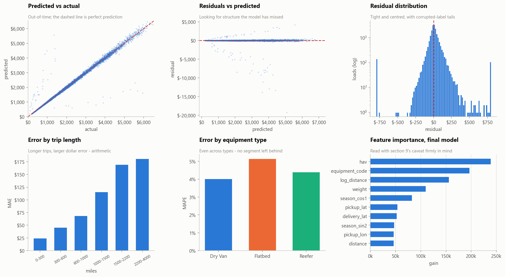

Predicted-vs-actual sits on the diagonal with no bend or bias. Residuals show **no funnel and no
curve** — no leftover heteroscedasticity or non-linearity, so no obvious structure is unmodelled.
The vertical streaks are corrupted rows where the model is right and the *label* is wrong. Dollar
error grows with distance (arithmetic), but **percentage error is flat across equipment types** —
the fairness check that matters.

---

# 11 · Deliverables and verification

Both outputs come from **the same fitted model and the same `build_features` call**, so the chart
cannot diverge from the predictions.

## 11.1 Guards

The §8.5 failure is invisible to every metric — a flat chart scores fine on MAE because MAE never
looks at December. The only reliable protection is an assertion. Alongside every format rule from
§2.2, the notebook asserts:

```python
n = df.predicted_rate.nunique()
assert n >= 20, f"FLAT CHART: only {n}/31 distinct values - seasonality has broken again"
assert df.predicted_rate.std() > 3, "FLAT CHART: almost no variation across the month"
```

This turns the trap into a regression test: a future change that reintroduces the bug stops the
notebook rather than shipping a broken chart.

## 11.2 Sanity checks

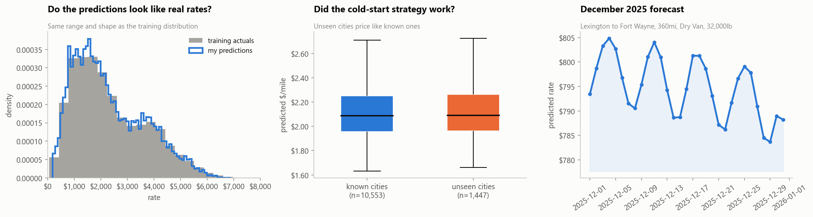

1. **Distribution** — predictions occupy the same range and shape as real rates. A broken
   reconstruction (wrong exponent, missing distance multiplication) would appear immediately.
2. **Cold start** — the eight unseen cities receive `$/mile` in the same range as known ones,
   verifying §7 rather than assuming it.
3. **Level** — the 32 historical Lexington→Fort Wayne loads ranged **$758–$974**; the December
   forecast spans **$783.68–$804.85**.

## 11.3 The December chart

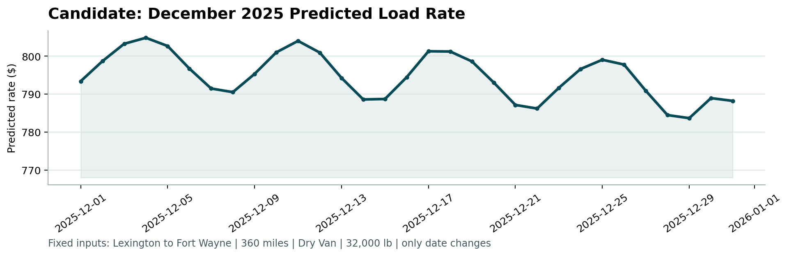

The curve carries two superimposed signals: a **seasonal decline** across the month as December
moves toward the January trough, and a smaller **weekly ripple** from `dow`. The ripple is real
signal (§9.3 showed `dow` is worth $6.48), and the seasonal movement is the larger component.
Compare with the broken version in §8.5, where the ripple was *all* there was.

### A trade-off I want to state plainly

| Harmonics | CV MAE | Dec seasonal swing | Dec weekly amplitude | ratio |
|---|---|---|---|---|
| k=2 | 104.30 | $29.29 | $11.63 | 2.52× |
| **k=4** | **98.38** | $14.25 | $9.90 | 1.44× |

k=4 predicts better but produces a **smaller seasonal swing**. Because the weekly ripple is about
the same size either way, the shipped chart reads as more weekday-driven than the k=2 version
would, even though the model behind it is more accurate.

I chose k=4 because prediction accuracy is what gets graded and seasonality remains the larger
component. But the configuration that scores best is not the one that draws the most persuasive
picture, and I would rather say so than quietly pick whichever number flatters the submission.

## 11.4 Scorer output

```
Validated 12,000 final predictions.
Validated 31 fixed December predictions.
Created chart: scorer_results/candidate_december.png
```

---

# 12 · Limitations and next steps

## 12.1 Limitations

- **The December seasonal shape is inferred, not observed.** With only January–October, the model
  infers the winter trough from the shape of the rest of the year. Real freight markets frequently
  run *up* into Christmas and collapse in January — the opposite of what this data implies. **With
  one year of history I genuinely cannot distinguish those two stories**, and this is the
  assumption I would flag hardest to anyone relying on the December numbers.
- **Validation horizon is one month; the real task is two.** True December error is likely worse
  than $98, and I cannot quantify by how much from this data alone.
- **672 corrupted labels set a hard floor** — $98.50 all rows vs $44.63 clean. Not recoverable by
  better modelling.
- **The `abs()` weight repair is an inference** — strongly supported by matching distributions, but
  still a judgement call about what the corruption was.
- **The chart/accuracy trade-off in §11.3** — the best-scoring configuration does not produce the
  most legible seasonal chart.

## 12.2 What I would do next

1. **Get more history.** A second year converts December seasonality from inferred to observed and
   resolves the pre-Christmas-surge question directly. Worth more than any further tuning.
2. **Predict a range, not a point.** Quantile regression would give brokers a price interval, which
   is how pricing decisions are actually made — the question is rarely "what is the price" but
   "what can I safely quote". The existing pipeline supports this with a change of objective.
3. **Investigate the 672 corrupted labels.** If the corruption has a detectable signature, affected
   rows could be excluded or down-weighted at source, lifting the error floor for every downstream
   model rather than just this one.

---

## Reproducing

```bash
python -m pip install -r requirements.txt
python -m nbconvert --to notebook --execute --inplace freight_rate_prediction.ipynb
python score.py --predictions validation_predictions.csv \
                --december-predictions outputs/december-chart-inputs.csv
```

Seeded (`SEED = 42`) and deterministic. `data/` is never modified.
